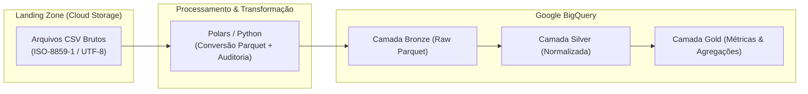

# Projeto de Análise de Emendas Parlamentares (ETL no GCP)


Este projeto tem como objetivo processar e analisar dados de **Emendas Parlamentares** através de um pipeline de ETL moderno na plataforma **Google Cloud Platform (GCP)**. A solução utiliza o **Cloud Storage (GCS)** para a camada Landing/Raw e o **BigQuery** para estruturação e análise dos dados, com processamento em memória de alta performance via **Polars**.

## 🎯 Objetivo

Construir um fluxo de ingestão, transformação e agregação (ETL) dos dados de Emendas Parlamentares. Os dados brutos são recebidos em formato CSV, refinados para o formato colunar Parquet em memória com metadados de auditoria (`_ingestion_timestamp`, `_source_file`) e carregados para o Google Cloud (GCS / BigQuery).

## 🏗️ Arquitetura de Dados



## ⚙️ Stack Tecnológica

- **Linguagem & Processamento:** Python 3.12, `polars`, `pandas`
- **Nuvem & Armazenamento:** Google Cloud Platform (BigQuery, Cloud Storage)
- **Gerenciador de Dependências:** `uv`
- **Linter & Qualidade de Código:** `ruff`
- **Testes Unitários:** `pytest`
- **CI/CD:** GitHub Actions

## 📂 Estrutura do Projeto

```
projeto/
├── .github/workflows/
│   └── ci_cd.yml                      # Pipeline de CI (Ruff + Pytest) e CD (Deploy GCP)
├── pyproject.toml                     # Configurações do projeto, ruff, pytest e dependências
├── uv.lock                            # Lockfile reproduzível do uv
├── database_sample/                   # Amostras leves para validação em CI
├── src/
│   ├── conexao/
│   │   └── big_query.py               # Conexão e autenticação com Google BigQuery
│   ├── processamento/
│   │   └── csv_parquet.py             # Processamento e conversão de CSV para Parquet
│   └── etl_emendas_parlamentares/
│       ├── __init__.py
│       └── emendas.py                 # Funções de sanitização e tratamento de colunas
└── tests/
    ├── conftest.py                    # Configurações globais do pytest
    └── emendas_test.py                # Testes unitários de sanitização de colunas
```

## 🚀 Como Executar

### 1. Pré-requisitos e Ambiente Local com `uv`

1. Instale o [uv](https://docs.astral.sh/uv/) (caso não tenha instalado).
2. Sincronize as dependências do ambiente:
   ```bash
   uv sync
   ```
3. Execute os testes unitários:
   ```bash
   uv run pytest
   ```
4. Execute o linter:
   ```bash
   uv run ruff check .
   ```

### 2. Execução dos Scripts

- Testar conexão com BigQuery:
  ```bash
  uv run python src/conexao/big_query.py
  ```
- Processar arquivos CSV para Parquet:
  ```bash
  uv run python src/processamento/csv_parquet.py
  ```
